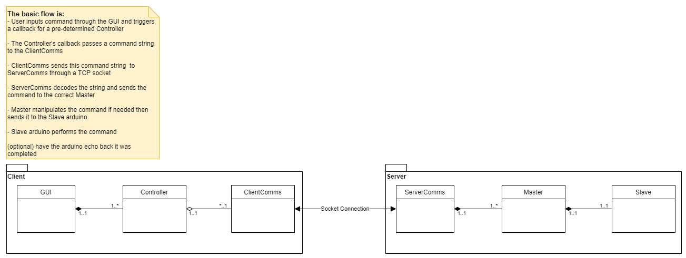

# rover-control-tutorial
This repo is to demonstrate on a basic level how UTA's mars rover is controlled. We use a Tkinter GUI to change the rate at which an onboard LED blinks on a Arduino through a server-client architecture using sockets.

## Setup
It is highly recommended to use [virtual environments](https://docs.python.org/3/tutorial/venv.html) within python to seperate each of your projects dependancies.  

1. Start your virutal environment, if you are using one. How to do this is dependant on your OS, for windows run: `.\.venv\Scripts\activate` where `.venv` is the directory that you created the virtual environment in.
2. Install the required libraries using the `requirements.txt` file *(there is only one in this tutorial that is not included in python's standard library)* `pip install -r requirements.txt`
3. Grab a USB type A male to type B male *standard arduino cable*
4. Flash your Arduino with the `arduino/serial_blink/serial_blink.ino` in the Arduino IDE

## Domain Model Diagram
This is the domain model diagram that represents the system we are building. It is very similar to how the Rover's systems function.  
  

## Running 
Before running make sure the `SERIAL_PORT` in `server/classes/Arduino.py` is the correct serial port for you arduino. An easy way to find your serial port is to open the Arduino IDE and see where your arduino is connected Tools -> Port.  
  
**!!! IMPORTANT !!!** You must close the Arduino IDE to run this, otherwise it blocks the Serial port for itself 

1. Open two terminals
2. Change directories into your sever folder and start your server's main.py in one terminal `python main.py`
3. Change directories into your client folder and start the client's main.py in the other terminal `python main.py`
    - A Tkinter gui with an input box and button should appear
    - Put in a time (milliseconds) to delay the blinking of the LED on your arduino
    - **There is no error checking in place, so inputting something besides a number will probably break it**
    - You should see some console output on the server's console, and the LED change its rate of blinking
4. When you are done, just exit out of the Tkinter gui and it will send a quit command to the server
